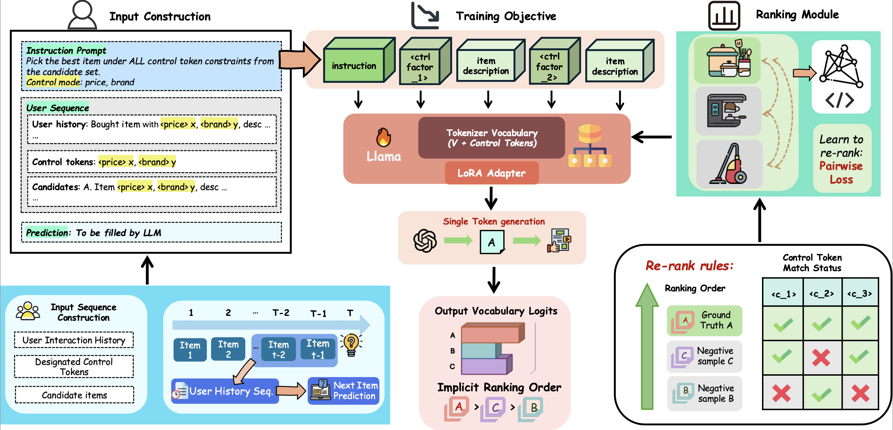

# TARS: Steering Large Language Models for Sequential Recommendation via Token-level Control

This repository contains the official implementation for the paper **TARS: Steering Large Language Models for Sequential Recommendation via Token-level Control**.

## Contribution

We design and implement TARS, a comprehensive token-augmented re-ranking framework. TARS integrates control token construction with textual user information, enabling flexible control schemes to augment recommendation results through explicit user control.

## Framework Pipeline

The overall architecture of the TARS framework is illustrated below.




## How to Run the Code

Follow the steps below to set up the environment and reproduce the results.

### 1. Environment Setup
First, create the conda environment from the `environment.yml` file.

```bash
conda env create -f environment.yml
conda activate tars_rec
```

### 2. Preprocess Data
Next, run the preprocessing script to prepare the dataset.

```bash
./preprocess.sh
```

### 3. Train Model

Once the data is preprocessed, use the following command to start training the TARS model.

```bash
./train.sh
```

### 4. Run Inference
After the model is trained, you can generate recommendations using the inference script.

```bash
./inference.sh
```

### 5. Evaluation
To evaluate the performance of the generated recommendations, run the evaluation script.

```bash
./evaluate.sh
```
